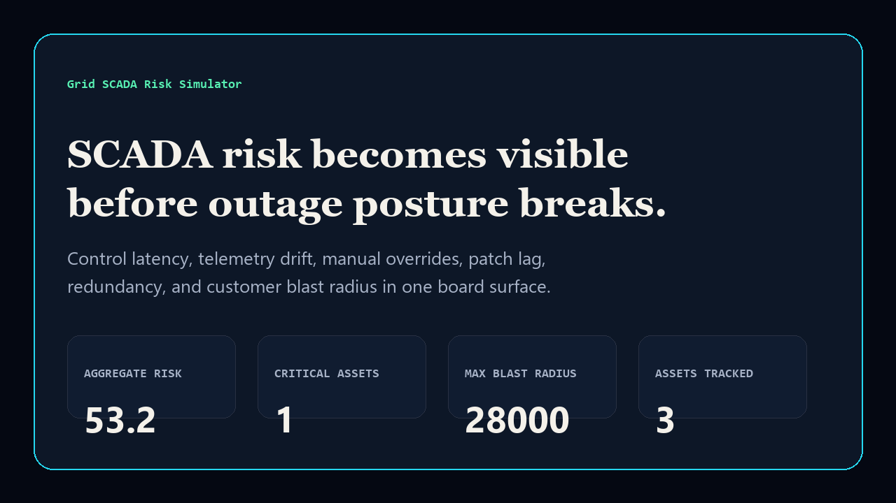
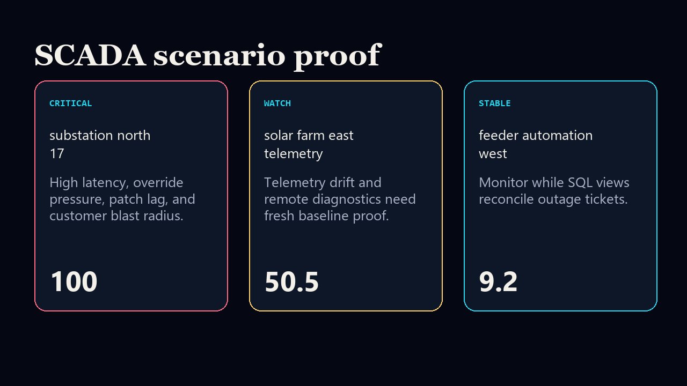

# grid-scada-risk-simulator

[](https://github.com/mizcausevic-dev/grid-scada-risk-simulator/actions/workflows/ci.yml)
[](https://github.com/mizcausevic-dev/grid-scada-risk-simulator/actions/workflows/pages.yml)
[](LICENSE)

Energy and utilities SCADA risk simulator for control latency, telemetry drift, manual overrides, outage blast radius, patch lag, redundancy posture, and remediation sequencing.

## Why this exists

- Grid risk becomes expensive when SCADA latency, telemetry drift, outage radius, and remediation proof live in separate operational systems.
- Energy and utility leaders need a board-readable way to distinguish urgent control-plane risk from ordinary telemetry cleanup.
- This repo provides practical C/C++, Python, SQL, and TypeScript proof without exposing real utility data or control-system details.

## Screenshots





## What it includes

- TypeScript scoring model and static executive surface.
- C++ risk calculation for control-system style scoring.
- Python scenario pack builder for audit-ready remediation packets.
- SQL risk views for SCADA and board posture reporting.
- CI, Pages publishing, smoke checks, docs, and security notes.

## Local run

```bash
npm install
npm run verify
npm run prerender
```

## Board question answered

> Which grid control assets are exposed, what is the outage blast radius, and which remediation sequence should move first?
